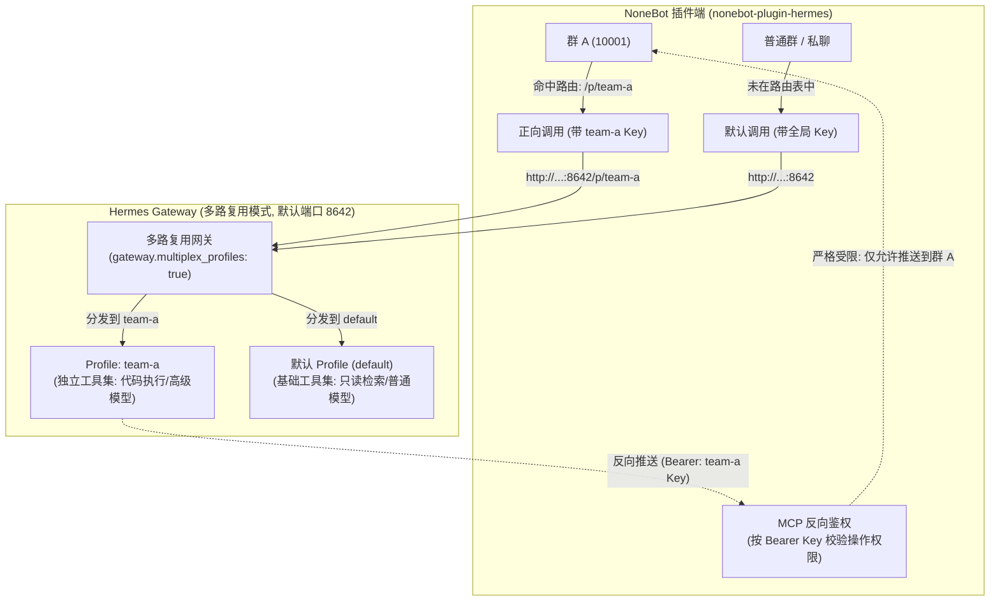

# 按群路由到不同 Hermes 接入点 (Profiles / 多路复用)

> **适用版本**：`0.5.1+`（默认关闭）。本文档已从 [README](README.md) 独立成篇。

通过配置群路由，可以让指定的群分别走各自独立的 Hermes **Profile**，从而实现**按群分配独占工具集、大模型、系统提示词与文件工作区**。

---

## 1. 概述与适用场景

### 确认这是不是你需要的方案

| 需求场景 | 推荐方案 | 运维成本 |
|---|---|---|
| **仅需防止记忆串门**<br>（例如：Bot 不在 B 群提及 A 群的聊天内容） | 开启 **Honcho 长期记忆隔离**<br>（配置 `HERMES_HONCHO_ENABLED=true`，详见 README） | 极低（单进程、无需修改部署、无需维护多个 Profile） |
| **需要按群隔离能力与权限**<br>（例如：A 群只能检索资料，B 群开放终端跑代码；或分别配置不同模型） | 开启 **Profile 群路由**（本文档方案） | 需为每个接入点维护独立的 Profile（`HERMES_HOME`、模型 Key 与配置） |

> [!NOTE]
> Profile 群路由不仅能按群隔离工具集与模型，也会天然隔离记忆（每个 Profile 拥有独立的 `state.db`）。同时，NoneBot 的反向通道权限（如主动推消息 `push_message` 等）也会按接入点自动收敛收窄。

---

### 核心工作流与架构图



---

## 2. 核心机制：三把 Key 的分工

配置群路由时，最容易混淆的是各类凭据。请先明确以下三把 Key 的职责：

| Key 名称 | 验证方 | 存放位置 | 作用说明 |
|---|---|---|---|
| **大模型 Provider Key**<br>（如 `ANTHROPIC_API_KEY`） | 大模型厂商 | `profiles/<name>/.env` | 供 Hermes Agent 进行 LLM 推理（多路复用下子 Profile **不继承** 宿主环境变量，必填）。 |
| **Hermes 入站 Key**<br>（`API_SERVER_KEY`） | Hermes 网关 | `profiles/<name>/.env` | 保护 `/p/<name>` 接入点，由 Hermes 校验入站请求合法性。 |
| **插件路由与反向 Key** | NoneBot 插件 | NoneBot 的 `.env` | 正向请求时呈给 Hermes；反向调用（MCP）时作为 Bearer 鉴权凭证，标识该 Profile 允许操作的群范围。 |

> [!IMPORTANT]
> **两端唯一需要完全一致的值是这把 `API_SERVER_KEY`：**
> 1. NoneBot 侧写进 `HERMES_GROUP_ENDPOINTS` 的 `key` 字段；
> 2. Hermes 侧写进对应 Profile 的 `.env` 中的 `API_SERVER_KEY`；
> 3. 若使用 MCP 反向通道，Hermes 该 Profile 也用这把 Key 作为 MCP 请求的 Bearer Token。
>
> 长度**不得少于 16 字符**，且必须与默认 Profile 的 Key 不同。

---

## 3. 分步操作指南

### 步骤一：Hermes 端启用多路复用（一次性配置）

多路复用允许**单一网关进程**同时服务默认 Profile 与所有子 Profile，各子 Profile 通过 `/p/<profile>/` 路径前缀访问。

在宿主机以**默认 Profile** 执行：

```bash
hermes config set gateway.multiplex_profiles true
hermes gateway restart
```

> [!TIP]
> 开启多路复用后，**不要**再为子 Profile 执行 `hermes gateway start`。所有的请求均由默认网关统一监听和分发。

> [!NOTE]
> 执行上面这条 `config set` 时，Hermes 会打印一句 `⚠ 'gateway.multiplex_profiles' is not a recognized config key — it was saved anyway`。**这是假警告，照做即可**：键值已写入、运行时也确实会读，只是它不在配置校验用的 `gateway` 已知子键表里。当前版本不会给出 “Did you mean” 建议，切勿因此改成别的键名。

---

### 步骤二：创建并配置子 Profile

以创建名为 `team-a` 的接入点为例：

```bash
# 1. 创建子 Profile (名称必须全小写)
hermes profile create team-a

# 2. 为该 Profile 配置大模型厂商 Key
team-a setup

# 3. 生成并配置该接入点的 API_SERVER_KEY (用于 NoneBot 与 Hermes 间鉴权)
TEAM_HOME=~/.hermes/profiles/team-a
echo "API_SERVER_KEY=$(openssl rand -hex 32)" >> $TEAM_HOME/.env

# 4. (可选) 安装该 Profile 专用的 Skill
HERMES_HOME=$TEAM_HOME hermes-install-skill
```

接下来编辑 `$TEAM_HOME/config.yaml`，按需限制该群可以使用的工具集：

```yaml
# ~/.hermes/profiles/team-a/config.yaml
# 为 team-a 配置独占的工具集清单（选法详见 README「限制 API Server 工具集」）
platform_toolsets:
  api_server:
    - terminal
    - file
    - code_execution
```

---

### 步骤三：插件侧配置群路由表

在 NoneBot 项目的 `.env` 中配置 `HERMES_GROUP_ENDPOINTS`。

- 键格式为 `{adapter}:{group_id}`（如 `onebotv11:10001`）；
- 值为包含 `url` 和 `key` 的对象；
- **未列出的群以及所有私聊**，将无缝沿用全局默认的 `HERMES_API_URL` 和 `HERMES_API_KEY`。

```dotenv
# 注意：在 .env 文件中必须写成单行 JSON，此处为便于展示进行了换行
HERMES_GROUP_ENDPOINTS='{
  "onebotv11:10001": {
    "url": "http://127.0.0.1:8642/p/team-a",
    "key": "<team-a 的 API_SERVER_KEY>"
  }
}'
```

---

### 步骤四（可选）：配置 MCP 反向通道权限收敛

如果需要让 Profile 中的 Agent 主动向群内发消息（`push_message`）、拉取上下文历史（`get_recent_messages` 等），需配置反向通道。

#### 反向权限收敛机制
NoneBot 的反向通道**没有第二张 Token 映射表**，直接复用上述的 `API_SERVER_KEY`：
- **子 Profile 呈上 `team-a` 的 Key**：NoneBot 严格限制该请求**只能操作路由到 `team-a` 的群**；
- **默认 Profile 呈上全局 `HERMES_API_KEY`**：只能操作**补集**（未在路由表中、或表内条目没有配自己 `key` 的群）；
- **呈上其他未识别的 Key**：直接返回 401 拦截。

#### MCP 配置规则（自持声明，名字全局唯一）
在多路复用架构下，MCP 的配置分为两部分：

1. **子 Profile 配置文件**（`~/.hermes/profiles/team-a/config.yaml`）：
   ```yaml
   # 1. 声明属于自己的反向连接 (server 名字全进程唯一，建议使用 nonebot-<profile>)
   mcp_servers:
     nonebot-team-a:
       url: http://<nonebot-host>:8643/mcp
       headers:
         Authorization: "Bearer ${API_SERVER_KEY}"  # 自动读取本 profile .env 中的值

   # 2. 显式授予该 Profile 使用该反向工具
   platform_toolsets:
     api_server:
       - terminal
       - nonebot-team-a   # 列出即收窄成白名单;一个 server 名都不列,本 profile 全部 enabled 的都会生效
   ```

2. **默认 Profile 配置文件**（`~/.hermes/config.yaml`）：
   ```yaml
   # 默认 Profile 只声明管辖补集群的 nonebot-default，不要替子 Profile 声明！
   mcp_servers:
     nonebot-default:
       url: http://<nonebot-host>:8643/mcp
       headers:
         Authorization: "Bearer <全局 HERMES_API_KEY>"

   platform_toolsets:
     api_server:
       - <原有默认工具集>
       - nonebot-default
   ```

> [!TIP]
> **MCP Server 命名原则**：每个 Profile 的 MCP 连接必须由**自己独立持有**，且 Server 名字在整个 Hermes 进程中必须全局唯一（如 `nonebot-team-a`、`nonebot-lab`）。默认 Profile 切勿替子 Profile 预先定义同名 Server，否则会导致子 Profile 工具注册被跳过。

> [!TIP]
> 若某个 Profile 完全不需要反向通道，在它的 `platform_toolsets.api_server` 里放上特殊哨兵 `no_mcp`，该 Profile 的全部 MCP 工具都会被关闭 —— 这比“不列出来”更明确（不列任何 server 名时，本 Profile 配置里全部 enabled 的 server 反而都会生效）。

> [!NOTE]
> 配好之后，插件每次启动都会打印一条 **INFO** 级提醒（触发条件：`HERMES_MCP_ENABLED=true` 且路由表里存在 `/p/` 形式的 url）。它在**配置完全正确时也必然出现** —— 插件无法从自己这侧核实对面 Hermes 究竟怎么配，所以只能用 INFO 而非 WARNING（每次正确启动都告警只会制造告警疲劳）。配好了直接忽略；真正的失败信号是推送那一刻的 `拒绝越权操作` WARNING（见第 5 节）。

---

## 4. 完整端到端示例

### 场景设定
- 群 `10001`、`10002`、`10003`、`10004`：研发群，共用 Profile `team-a`（开放代码执行工具）。
- 群 `10005`、`10006`：产品体验群，共用 Profile `lab`（只开放网页检索工具）。
- 其余所有群与全部私聊：走默认 Profile。

> [!IMPORTANT]
> 尽管共有 6 个群配置了路由，但因为只涉及 2 个独立的 Profile，因此反向通道仅需配置 **2 个命名 Server**（`nonebot-team-a`、`nonebot-lab`）加 1 个默认 Server（`nonebot-default`），**而不是配置 6 个**。

---

### ① NoneBot 侧 `.env` 配置

```dotenv
# .env (生产环境中需合并为一行)
HERMES_GROUP_ENDPOINTS='{
  "onebotv11:10001": { "url": "http://10.0.0.2:8642/p/team-a", "key": "sk-team-a-secret-key-16chars-min" },
  "onebotv11:10002": { "url": "http://10.0.0.2:8642/p/team-a", "key": "sk-team-a-secret-key-16chars-min" },
  "onebotv11:10003": { "url": "http://10.0.0.2:8642/p/team-a", "key": "sk-team-a-secret-key-16chars-min" },
  "onebotv11:10004": { "url": "http://10.0.0.2:8642/p/team-a", "key": "sk-team-a-secret-key-16chars-min" },
  "onebotv11:10005": { "url": "http://10.0.0.2:8642/p/lab",    "key": "sk-lab-secret-key-16chars-min" },
  "onebotv11:10006": { "url": "http://10.0.0.2:8642/p/lab",    "key": "sk-lab-secret-key-16chars-min" }
}'
```

---

### ② Hermes 默认 Profile (`~/.hermes/config.yaml`)

```yaml
# 仅配置属于默认 Profile 的反向通道
mcp_servers:
  nonebot-default:
    url: http://10.0.0.1:8643/mcp
    headers:
      Authorization: "Bearer <全局 HERMES_API_KEY>"

platform_toolsets:
  api_server:
    - web
    - nonebot-default
```

---

### ③ Hermes `team-a` (`~/.hermes/profiles/team-a/config.yaml`)

```yaml
# team-a 专属配置
mcp_servers:
  nonebot-team-a:
    url: http://10.0.0.1:8643/mcp
    headers:
      Authorization: "Bearer ${API_SERVER_KEY}"  # 读自本 profile 的 .env

platform_toolsets:
  api_server:
    - terminal
    - file
    - code_execution
    - nonebot-team-a
```
其对应的 `~/.hermes/profiles/team-a/.env`：
```dotenv
ANTHROPIC_API_KEY=sk-ant-api03-...
API_SERVER_KEY=sk-team-a-secret-key-16chars-min
```

---

### ④ Hermes `lab` (`~/.hermes/profiles/lab/config.yaml`)

```yaml
# lab 专属配置
mcp_servers:
  nonebot-lab:
    url: http://10.0.0.1:8643/mcp
    headers:
      Authorization: "Bearer ${API_SERVER_KEY}"

platform_toolsets:
  api_server:
    - web
    - nonebot-lab
```
其对应的 `~/.hermes/profiles/lab/.env`：
```dotenv
OPENAI_API_KEY=sk-proj-...
API_SERVER_KEY=sk-lab-secret-key-16chars-min
```

---

## 5. 验证与健康检查

### 1. 验证 Hermes 接入点前缀与鉴权 (Ground Truth)

在服务器上使用 `curl` 探测 Hermes 的模型接口：

```bash
curl -s -o /dev/null -w '%{http_code}\n' \
  -H "Authorization: Bearer <team-a 的 API_SERVER_KEY>" \
  http://<hermes-host>:8642/p/team-a/v1/models
```

| HTTP 状态码 | 诊断分析 |
|---|---|
| **`200`** | **配置完全正确**，多路复用已生效，Key 校验通过。 |
| **`401`** | **多路复用未开启**（网关静默忽略了 `/p/team-a` 前缀并以默认 Profile 校验）或 **Key 不匹配**。 |
| **`404`** | **Profile 不存在**，或未在 `multiplex_profile_allowlist` 允许列表中。 |

---

### 2. 检查 Bot 插件侧状态

- **普通用户命令 `/ping`**：在群内发送 `/ping`，只会测试当前群所指向的接入点连通性。
- **管理员命令 `/hermes-status`**：在聊天窗口执行该命令，将逐个对路由表中的所有接入点进行健康检查并列出状态。
- **启动日志排查**：插件启动时会自动对路由表进行校验，如果存在非法 URL、Key 短于 16 字符、同一接入点配置了多把不同 Key 等问题，控制台会输出明确的 `WARNING`。

---

### 3. 反向通道权限越权验证

当某个 Profile 试图通过反向通道向不属于自己的群推送消息时，NoneBot 会立即拦截并记录安全日志：
```
[WARNING] [HERMES MCP] 拒绝越权操作 (onebotv11, 10005) —— caller: endpoint=http://10.0.0.2:8642/p/team-a groups=['onebotv11:10001', 'onebotv11:10002', ...]
```
若在日常使用中发现某个群无法收到主动推送，先在 Bot 端 grep `拒绝越权操作`。

---

## 6. 避坑指南与常见问题

### 1. Profile 命名必须全小写
- **规范**：仅允许使用小写字母、数字及下划线短横线（`[a-z0-9_-]`）。
- **原因**：Hermes 落盘目录名为全小写，且 URL 前缀比对**不执行大小写归一化**。若使用 `TeamA`，请求访问 `/p/TeamA/` 对比本地 `teama` 会直接返回 **404**。
- **避免命令名冲突**：`hermes profile create <name>` 会在 `~/.local/bin/<name>` 生成命令包装脚本。起名前先执行 `command -v <name>`，避免使用与系统常用命令同名的名字（如 `docker`、`top`、`web` 等）。

### 2. 多路复用模式下的凭据独立性
- 多路复用下，子 Profile **不会** 回落继承系统宿主环境的 `os.environ`（如环境变量中的大模型 API Key、搜索 Key 等）。
- **每一个子 Profile 必须在自己的 `.env` 中独立声明所需的全部凭据**，否则 Agent 无法调用模型。

### 3. 端口绑定类平台管理
- 在多路复用模式下，HTTP 端口监听器全部由默认 Profile 托管（共享 Listener 机制）。
- 复制 `config.yaml`（如使用 `--clone` 参数）时，请务必检查子 Profile 的配置，确认已将端口绑定类平台（如 `platforms.api_server` 等）设为 `enabled: false`，避免启动时产生端口冲突警告。

### 4. 路由变更后清理旧会话
- 如果在 `HERMES_GROUP_ENDPOINTS` 中更改了某个群所指向的 Profile，请在群内执行一次 `/clear` 重置会话。
- 否则旧的 session id 会在新的 Profile 中静默创建一条同名的新上下文，导致上下文割裂在两份不同的 `state.db` 中。

### 5. `session_search` 跨群检索防护
- Hermes 的 `session_search` 工具会在本地数据库中检索历史会话。
- 隔离到不同 Profile 的群天然具备独立的 `state.db`，不会互相搜索；若同一 Profile 下的多个群不希望共享检索，可在该 Profile 的 `platform_toolsets.api_server` 中移除 `session_search` 工具。

