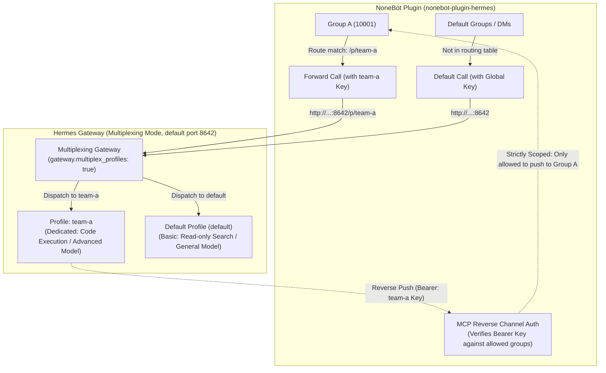

# Per-Group Endpoint Routing (Profiles / Multiplexing)

> **Applies to**: `0.5.1+` (disabled by default). Extracted from [README_EN.md](README_EN.md) into a standalone guide.

Route specific groups to their own Hermes **profiles**, allowing different groups to have **dedicated toolsets, LLM models, system prompts, and file workspaces**.

---

## 1. Overview & When to Use

### Confirm Whether This Fits Your Needs

| Scenario | Recommended Approach | Operational Cost |
|---|---|---|
| **Only prevent memory cross-talk**<br>(e.g., Bot shouldn't mention Group A's discussions in Group B) | Enable **Honcho Long-Term Memory Scope**<br>(Set `HERMES_HONCHO_ENABLED=true`, see README) | Minimal (single process, no deployment changes, no extra profiles to maintain) |
| **Isolate capabilities, models, or permissions per group**<br>(e.g., Group A has search-only tools, Group B has code execution; or different model backends) | Enable **Profile Routing** (this guide) | Moderate (manage a dedicated profile per endpoint: `HERMES_HOME`, provider keys, configs) |

> [!NOTE]
> Profile routing not only isolates tools and models, but also isolates memory naturally (each profile maintains its own `state.db`). Concurrently, reverse channel permissions (such as `push_message`) automatically narrow to the groups routed to that profile.

---

### Core Architecture & Workflow



---

## 2. The Three Keys Demystified

When setting up per-group routing, credentials are the most common source of confusion. Understand the purpose of each key:

| Key Name | Validated By | Stored In | Description |
|---|---|---|---|
| **LLM Provider Key**<br>(e.g., `ANTHROPIC_API_KEY`) | Model Provider | `profiles/<name>/.env` | Used by the Hermes Agent for LLM inference (under multiplexing, sub-profiles **do not** inherit host environment variables; mandatory). |
| **Hermes Inbound Key**<br>(`API_SERVER_KEY`) | Hermes Gateway | `profiles/<name>/.env` | Protects the `/p/<name>` endpoint; Hermes validates incoming requests against this key. |
| **Plugin Route & Reverse Key** | NoneBot Plugin | NoneBot's `.env` | Presented to Hermes on forward requests; presented back to NoneBot as a Bearer token during reverse MCP calls to identify permitted group scopes. |

> [!IMPORTANT]
> **The only value that must match on both sides is `API_SERVER_KEY`:**
> 1. Set on the NoneBot side in `HERMES_GROUP_ENDPOINTS[...].key`;
> 2. Set on the Hermes side in the profile's `.env` as `API_SERVER_KEY`;
> 3. Used as the Bearer token when the profile connects to the NoneBot MCP reverse channel.
>
> Must be **at least 16 characters long** and distinct from the default profile's key.

---

## 3. Step-by-Step Setup Guide

### Step 1: Enable Multiplexing on Hermes (One-Time Setup)

Multiplexing allows a **single gateway process** to serve the default profile and all sub-profiles simultaneously. Sub-profiles are accessed via the `/p/<profile>/` URL path prefix.

Run once on the host under the **default profile**:

```bash
hermes config set gateway.multiplex_profiles true
hermes gateway restart
```

> [!TIP]
> With multiplexing enabled, **do not** run `hermes gateway start` for secondary profiles. All requests are routed and handled by the default gateway multiplexer.

> [!NOTE]
> The `config set` above prints `⚠ 'gateway.multiplex_profiles' is not a recognized config key — it was saved anyway`. **This warning is spurious**: the value is written and the runtime does read it; the key simply is not in the validator's table of known `gateway` sub-keys. Current versions offer no "Did you mean" suggestion — do not rename the key because of it.

---

### Step 2: Create and Configure the Secondary Profile

Taking a profile named `team-a` as an example:

```bash
# 1. Create the secondary profile (name must be strictly lowercase)
hermes profile create team-a

# 2. Configure model vendor keys for this profile
team-a setup

# 3. Generate and set the API_SERVER_KEY (used for authentication between NoneBot and Hermes)
TEAM_HOME=~/.hermes/profiles/team-a
echo "API_SERVER_KEY=$(openssl rand -hex 32)" >> $TEAM_HOME/.env

# 4. (Optional) Install skills specific to this profile
HERMES_HOME=$TEAM_HOME hermes-install-skill
```

Next, edit `$TEAM_HOME/config.yaml` to restrict toolsets for this group:

```yaml
# ~/.hermes/profiles/team-a/config.yaml
platform_toolsets:
  api_server:
    - terminal
    - file
    - code_execution
```

---

### Step 3: Configure Group Routing in NoneBot

In your NoneBot project's `.env`, configure `HERMES_GROUP_ENDPOINTS`:

- Keys follow the format `{adapter}:{group_id}` (e.g. `onebotv11:10001`);
- Values are objects with `url` and `key`;
- **Any group not listed (and all private chats)** seamlessly fallback to the global `HERMES_API_URL` and `HERMES_API_KEY`.

```dotenv
# Note: Must be formatted as a single-line JSON string in .env (wrapped here for readability)
HERMES_GROUP_ENDPOINTS='{
  "onebotv11:10001": {
    "url": "http://127.0.0.1:8642/p/team-a",
    "key": "<team-a API_SERVER_KEY>"
  }
}'
```

---

### Step 4 (Optional): Configure MCP Reverse Channel Scoping

If agents need to push messages proactively (`push_message`) or fetch history (`get_recent_messages`), configure the reverse channel.

#### Automatic Scope Narrowing
NoneBot's reverse channel has **no secondary token table**; it directly inspects the `API_SERVER_KEY`:
- **Presenter holds `team-a`'s Key**: NoneBot strictly restricts calls to **groups routed to `team-a`**;
- **Presenter holds global `HERMES_API_KEY`**: Restricts calls to the **complement** (groups not in the routing table, or whose entry has no key of its own);
- **Any unrecognized token**: Rejected with HTTP 401.

#### MCP Configuration Rules (Self-Contained & Globally Unique Names)
Under multiplexing, MCP configuration is split as follows:

1. **Secondary Profile Config** (`~/.hermes/profiles/team-a/config.yaml`):
   ```yaml
   # 1. Define its own reverse connection (server name must be unique across the process)
   mcp_servers:
     nonebot-team-a:
       url: http://<nonebot-host>:8643/mcp
       headers:
         Authorization: "Bearer ${API_SERVER_KEY}"  # Reads from this profile's .env

   # 2. Explicitly grant this profile access to its own reverse channel
   platform_toolsets:
     api_server:
       - terminal
       - nonebot-team-a   # listing it narrows to an allowlist; list none and every enabled server applies
   ```

2. **Default Profile Config** (`~/.hermes/config.yaml`):
   ```yaml
   # The default profile only defines its own nonebot-default server; do not declare secondary servers here!
   mcp_servers:
     nonebot-default:
       url: http://<nonebot-host>:8643/mcp
       headers:
         Authorization: "Bearer <global HERMES_API_KEY>"

   platform_toolsets:
     api_server:
       - <existing toolsets>
       - nonebot-default
   ```

> [!TIP]
> **MCP Server Naming Principle**: Each profile's MCP connection must be **self-contained**, and server names must be unique across the entire Hermes process (e.g. `nonebot-team-a`, `nonebot-lab`). The default profile must not define servers on behalf of secondary profiles, or the secondary profile's discovery will be skipped.

> [!TIP]
> If a profile needs no reverse channel at all, put the special `no_mcp` sentinel in its `platform_toolsets.api_server`: every MCP tool is then off for that profile. This is more explicit than omitting the name — listing no server name at all actually enables every server enabled in that profile's own config.

> [!NOTE]
> Once configured, the plugin logs an **INFO**-level notice on every startup (triggered whenever `HERMES_MCP_ENABLED=true` and the routing table contains a `/p/` url). It fires **even on a completely correct setup** — the plugin cannot verify from its own side how the Hermes end is configured, so it is INFO rather than WARNING (an alarm on every correct boot only breeds fatigue). Ignore it once you have configured things; the real failure signal is the `拒绝越权操作` WARNING at push time (see section 5).

---

## 4. Complete Worked Example

### Scenario
- Groups `10001`, `10002`, `10003`, `10004`: Dev team, sharing profile `team-a` (with code execution enabled).
- Groups `10005`, `10006`: Lab/trial team, sharing profile `lab` (with web search only).
- All other groups and private chats: Routed to the default profile.

> [!IMPORTANT]
> Although 6 groups are routed, there are only 2 distinct named profiles. Therefore, the reverse channel only needs **2 named servers** (`nonebot-team-a`, `nonebot-lab`) plus 1 complement server (`nonebot-default`) — **not 6 servers**.

---

### ① NoneBot Side: `.env`

```dotenv
# .env (must be on a single line in production)
HERMES_GROUP_ENDPOINTS='{
  "onebotv11:10001": { "url": "http://10.0.0.2:8642/p/team-a", "key": "sk-team-a-secret-key-16chars-min" },
  "onebotv11:10002": { "url": "http://10.0.0.2:8642/p/team-a", "key": "sk-team-a-secret-key-16chars-min" },
  "onebotv11:10003": { "url": "http://10.0.0.2:8642/p/team-a", "key": "sk-team-a-secret-key-16chars-min" },
  "onebotv11:10004": { "url": "http://10.0.0.2:8642/p/team-a", "key": "sk-team-a-secret-key-16chars-min" },
  "onebotv11:10005": { "url": "http://10.0.0.2:8642/p/lab",    "key": "sk-lab-secret-key-16chars-min" },
  "onebotv11:10006": { "url": "http://10.0.0.2:8642/p/lab",    "key": "sk-lab-secret-key-16chars-min" }
}'
```

---

### ② Hermes Default Profile (`~/.hermes/config.yaml`)

```yaml
mcp_servers:
  nonebot-default:
    url: http://10.0.0.1:8643/mcp
    headers:
      Authorization: "Bearer <global HERMES_API_KEY>"

platform_toolsets:
  api_server:
    - web
    - nonebot-default
```

---

### ③ Hermes `team-a` (`~/.hermes/profiles/team-a/config.yaml`)

```yaml
mcp_servers:
  nonebot-team-a:
    url: http://10.0.0.1:8643/mcp
    headers:
      Authorization: "Bearer ${API_SERVER_KEY}"  # Reads from this profile's .env

platform_toolsets:
  api_server:
    - terminal
    - file
    - code_execution
    - nonebot-team-a
```
Corresponding `~/.hermes/profiles/team-a/.env`:
```dotenv
ANTHROPIC_API_KEY=sk-ant-api03-...
API_SERVER_KEY=sk-team-a-secret-key-16chars-min
```

---

### ④ Hermes `lab` (`~/.hermes/profiles/lab/config.yaml`)

```yaml
mcp_servers:
  nonebot-lab:
    url: http://10.0.0.1:8643/mcp
    headers:
      Authorization: "Bearer ${API_SERVER_KEY}"

platform_toolsets:
  api_server:
    - web
    - nonebot-lab
```
Corresponding `~/.hermes/profiles/lab/.env`:
```dotenv
OPENAI_API_KEY=sk-proj-...
API_SERVER_KEY=sk-lab-secret-key-16chars-min
```

---

## 5. Verification & Health Checks

### 1. Verify Profile Endpoint & Auth (Ground Truth)

Test the Hermes models endpoint with `curl`:

```bash
curl -s -o /dev/null -w '%{http_code}\n' \
  -H "Authorization: Bearer <team-a API_SERVER_KEY>" \
  http://<hermes-host>:8642/p/team-a/v1/models
```

| HTTP Status | Diagnosis |
|---|---|
| **`200`** | **Working properly**: Multiplexing is active and the key is valid. |
| **`401`** | **Multiplexing is off** (the gateway silently ignored `/p/team-a` and checked default credentials) or **key mismatch**. |
| **`404`** | **Profile not found** or excluded by `multiplex_profile_allowlist`. |

---

### 2. Check Plugin Status on NoneBot

- **User Command `/ping`**: Probes the endpoint mapped to the current chat session.
- **Admin Command `/hermes-status`**: Conducts a health check across all endpoints in the routing table.
- **Startup Diagnostics**: The plugin validates the routing table at boot. Any invalid URLs, keys under 16 characters, or conflicting keys on the same URL will be logged as clear `WARNING`s.

---

### 3. Verify Reverse Channel Permission Scope

If a profile attempts to push messages to a group outside its allowed scope, NoneBot denies the request and logs a warning:
```
[WARNING] [HERMES MCP] 拒绝越权操作 (onebotv11, 10005) —— caller: endpoint=http://10.0.0.2:8642/p/team-a groups=['onebotv11:10001', 'onebotv11:10002', ...]
```
The log line itself is emitted in Chinese — grep for `拒绝越权操作` when an agent's proactive
messages are not arriving.

---

## 6. Key Rules & Common Pitfalls

### 1. Profile Names Must Be Lowercase
- **Requirement**: Use only lowercase alphanumeric characters, underscores, and dashes (`[a-z0-9_-]`).
- **Reason**: Hermes creates on-disk directories in lowercase, and URL prefixes are compared **without case normalization**. Accessing `/p/TeamA/` against `profiles/teama/` will return **404**.
- **Avoid Shadowing Commands**: `hermes profile create <name>` generates a CLI wrapper script at `~/.local/bin/<name>`. Run `command -v <name>` before naming to prevent shadowing common system utilities (such as `docker`, `top`, `web`).

### 2. Credential Isolation Under Multiplexing
- Under multiplexing, secondary profiles **do not inherit** `os.environ` from the host shell.
- **All credentials required by a profile (LLM provider keys, search API keys, etc.) must be defined in its own `.env` file.**

### 3. Port-Binding Platforms
- Under multiplexing, inbound HTTP listeners are hosted exclusively by the default profile via shared listeners.
- When cloning configurations (`--clone`), ensure that port-binding adapters in secondary profiles (e.g. `platforms.api_server`) are set to `enabled: false` to avoid startup warnings.

### 4. Clear Sessions After Route Changes
- If you change a group's profile in `HERMES_GROUP_ENDPOINTS`, run `/clear` in that group.
- Otherwise, the old session ID will not be found in the new profile's `state.db`, resulting in a new session being silently spawned with identical names across distinct databases.

### 5. `session_search` Cross-Group Security
- Hermes provides a `session_search` tool for querying conversation history.
- Profiles isolate `state.db` files by default. If multiple groups share a single profile and you do not want them searching each other's sessions, remove `session_search` from that profile's `platform_toolsets.api_server`.
